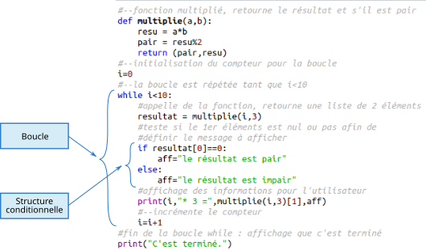

# Mémo info PTSI/PT

## Table des matières

1. [Binaire](./0%20-%20Binaire.md)
1. [Tracé de courbes](./1%20-%20Tracés%20de%20courbes.md)
1. [Fichiers textes](./2%20-%20Fichiers%20textes.md)
1. [Stratégies (récursivité...)](./3%20-%20Stratégies.md)
1. [Complexité](./4%20-%20Complexité.md)
1. [Traitement de données](./5%20-%20Traitement%20de%20données.md)
1. [Analyse](./6%20-%20Analyse.md)
1. [SQL](./7%20-%20SQL.md)
1. [AI](./8%20-%20IA.md)

## Les bases ?

