# Créer son pack de texture Minecraft Java

Ce tutoriel s'adresse à ceux qui veulent créer leur pack de texture soit à partir des textures du jeu directement ou bien en mélangeant des packs pris sur Internet.

---

## Table des matières

* [Comment marche un pack de texture ?](#comment-marche-un-pack-de-texture)
* [Créer son pack](#créer-son-pack)  
    1. [Prérequis](#prérequis)
    2. [Avant de commencer](#avant-de-commencer)
    3. [Modifier la description](#modifier-la-description)
    4. [Modifier une texture](#modifier-une-texture)
    5. [Créer un modèle 3D](#créer-un-modèle-3d)
* [Mélanger des packs](#mélanger-des-packs-de-textures)

---

## Comment marche un pack de texture ?

Le jeu divise les blocks en 3 parties, les items en 2 et les entités n'ont que leur texture.  

* ### Les Blocks

  * Blockstates : ce fichier .json permet d'associer à chaque sous-état[^1] d'un block le model 3D associé, il permet également de rajouter des variants à un même sous-état[^1].  
  * Model : ce fichier .json définit le model utilisé par le block, il peut faire appel à un model parent
  * Texture(s) : un ou plusieurs .png, généralement un / coté

* ### Les items

  * Model : ce fichier .json définit le model utilisé par l'item, il peut faire appel à un model parent et définit comment doit être affiché l'item dans l'inventaire, dans un cadre...
  * Texture(s) : un ou plusieurs ( si model 3d custom) .png

* ### Les entitées

  * Texture : accesibles dans *NomDuPack*/assets/minecraft/textures/entity il existe soit un fichier / entitées ou un dossier avec des variants

* ### Nomenclature

  * Tout les noms des fichiers sont ceux des identifiants présent dans le jeu, si vous jouez en anglais retrouver la texture de l'herbe(*grass*) est simple, il suffit de rechercher son nom dans le dossier *textures*.  
    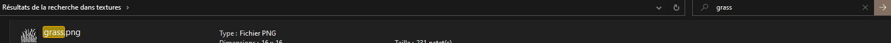

* ### Résumé

    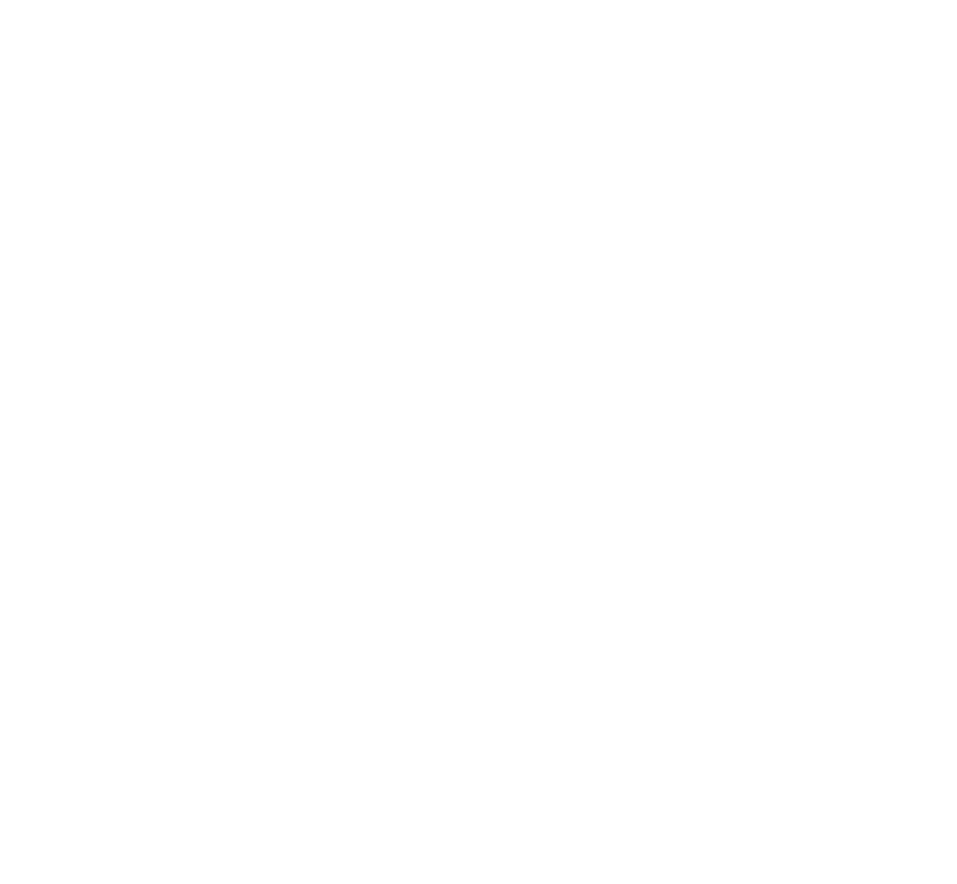

# Créer son pack

## Prérequis

* Paint3D ou tout autre logiciel de dessin de votre choix
* Pour ouvrir les .json : bloc-note ( installé par défaut sur Windows)
* Pour faire de la 3D : Blockbench (gratuit), à télécharger [ici](https://www.blockbench.net/downloads), ou à utiliser en [ligne](https://web.blockbench.net/)

## Avant de commencer

* Installer le Template dans le dossier texture pack du jeu :
  * Appuyer sur <kbd>Windows</kbd> + <kbd>R</kbd>
  * Entrer dans la fenetre qui viens de s'ouvrir :  %appdata%\.minecraft\resourcepacks
    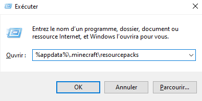
  * Télécharger le [template](./Template.zip) et dézipper le. On doit obtenr ceci :
    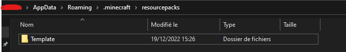
  * Charger le pack de texture dans le jeu :
    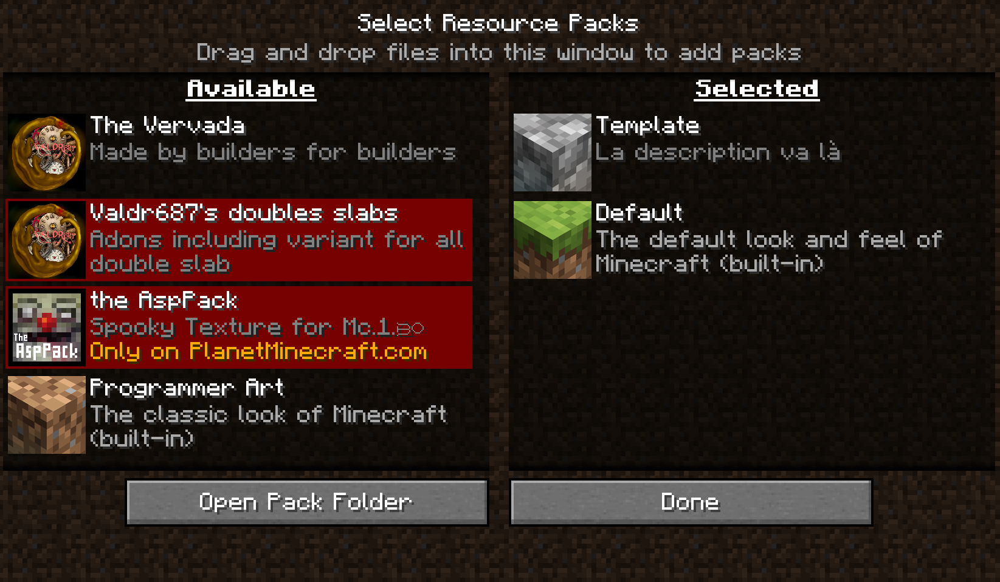

## Modifier la description

* Ouvrir *pack.mcmeta* avec le bloc note.

``` json
{
   "pack": {
      "pack_format": 13,
      "description": "La description va là"
   }
}
```

* Le "pack_format" désigne la version du jeu, 12 correspond à la 1.19.3, incrémenter de 1 cette valeur augmente la version du pack.

* La "description" porte bien son nom, il suffit de modifier le texte entre guillemets.

## Modifier une texture

On va prendre un exemple tout simple, le tronc de chene (oak log), le principe est le même pour toutes les autres textures. Je cherche à modifier une texture donc je me rend dans le dossier *textures*, puis *block* et je vais sélectionner la texture "*oak_log_top.png*" puis l'ouvrir dans Paint3D. J'ai fais ceci :
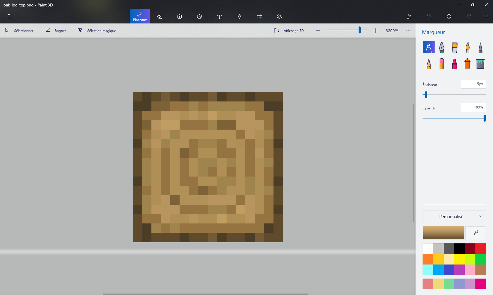
Après sauvegarde et recharge du pack de texture (<kbd>F3</kbd> + <kbd>T</kbd>), j'obtiens ceci :
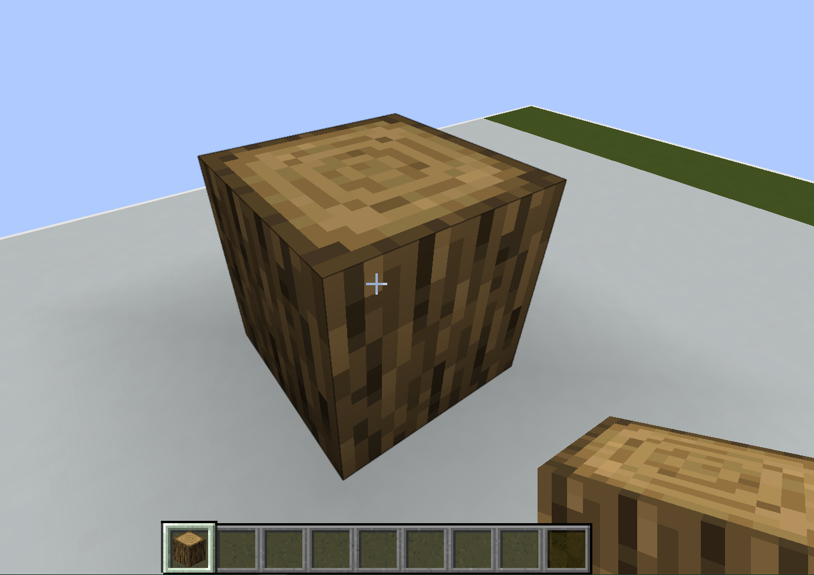

## Créer un modèle 3D

Pour créer un model 3D il faut aller dans le dossier *model*, puis dans *block* ou *item* en fonction de son choix. Ici je fais prendre l'exemple de la bibliothèque :

* Ouvrir le model dans blockbench : <kbd>Crtl</kbd> + <kbd>O</kbd>
* On obtient ceci :
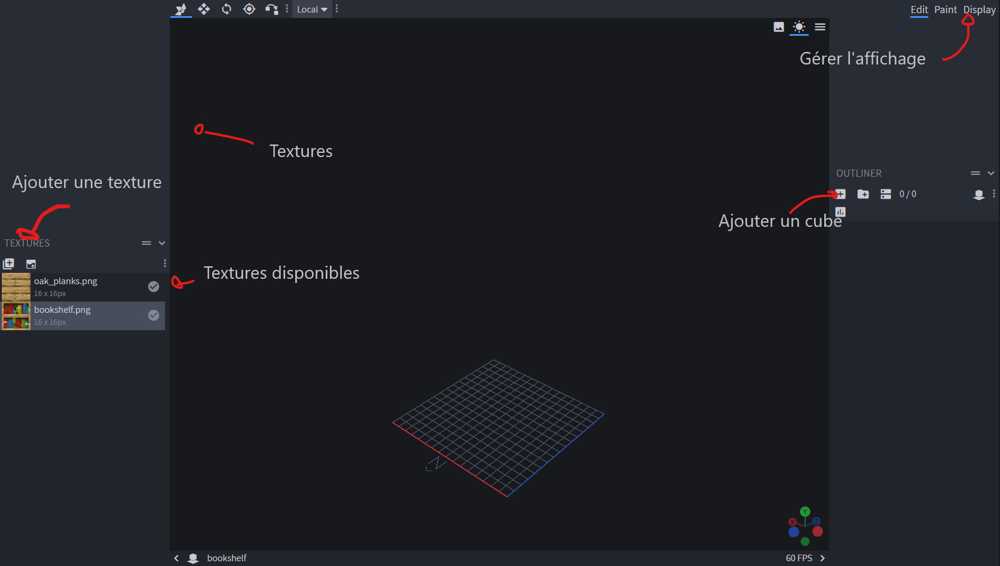
* Après ajout d'un cube, et gestion des textures dans le panneau de gauche, j'obtiens le block par défaut :
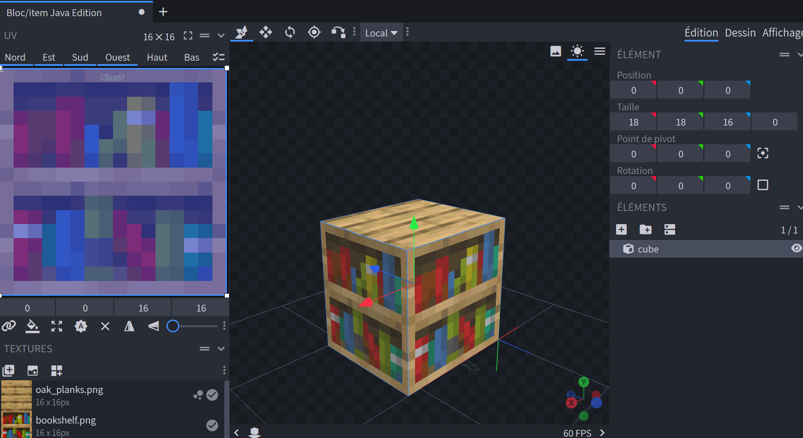
* Après modification, sauvegarde (<kbd>Crtl</kbd> + <kbd>S</kbd>) et recharge du pack de texture (<kbd>F3</kbd> + <kbd>T</kbd>)  j'obtiens ceci dans le jeu :
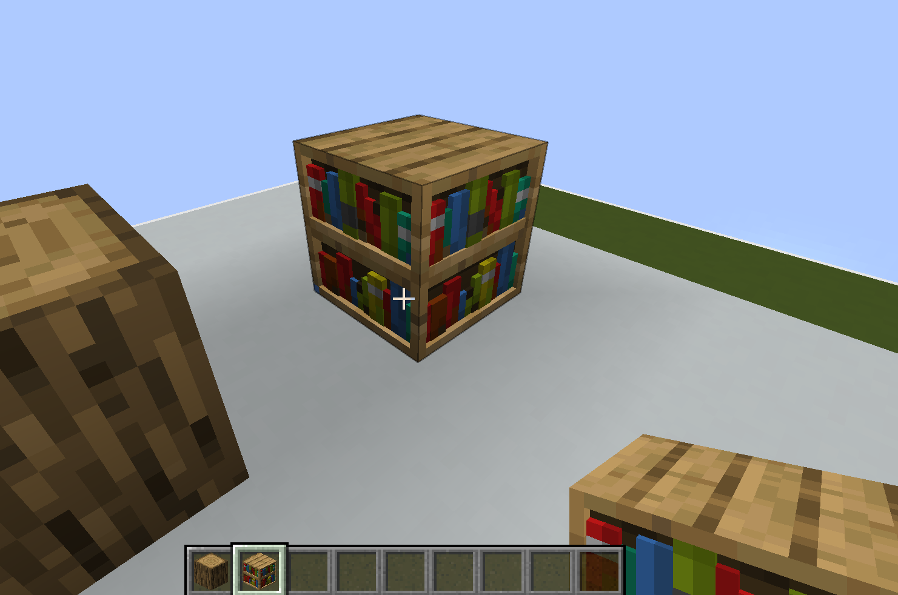
Pour référence j'avais ceci dans blockbench :
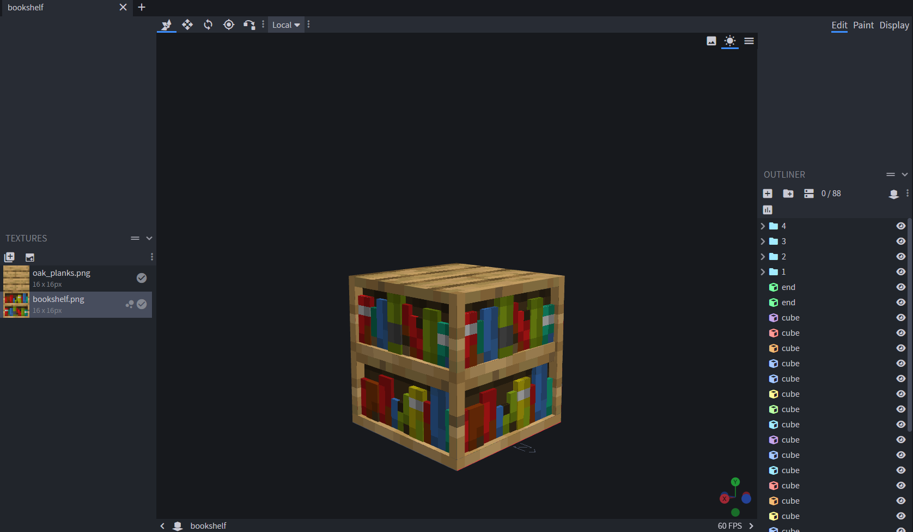

Pour accéder à plus d'astuces, tutos sur Blockbench, il existe ce [wiki](https://www.blockbench.net/wiki/guides/blockbench-overview-tips) et Internet.

# Mélanger des packs de textures

Pour son usage personnel, ou sous réserve de respecter la license des packs mélangés, il est tout à fait légal et possible de modifier, mélanger des packs pris sur internet.  
Le principe est le même que de créer son pack, il suffit de déziper le pack et de copier-coller les fichiers en respectant le chemin. Pour ça il suffit d'utiliser la zone de recherche avec le nom du block et de copier-coller.

[^1]: Désigne un variant d'un block  
