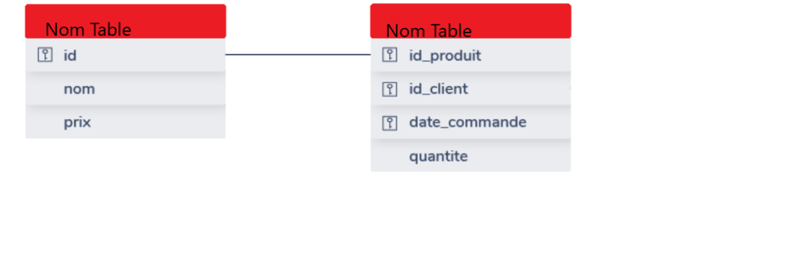

# La Certification

> Après avoir évalué et développé vos compétences numériques via votre profil Pix, la certification Pix vous permet de les valoriser officiellement. A travers une session de certification, Pix vérifie la sincérité de votre profil et vous délivre un certificat.

## Déroulement de l'épreuve

[Le déroulement de l'épreuve est accesible en cliquant ici](https://support.pix.org/fr/support/solutions/articles/15000039381-comment-se-d%C3%A9roule-la-session-de-certification-)

## Ce qu'il faut savoir

- Il est autorisé de venir avec son ordinateur personnel, [article accesible ici](https://support.pix.org/fr/support/solutions/articles/15000039384-puis-je-amener-mon-ordinateur-ou-choisir-le-syst%C3%A8me-d-exploitation-de-l-ordinateur-sur-lequel-je-sera). [archive](https://web.archive.org/web/20210730103802/https://support.pix.org/fr/support/solutions/articles/15000039384-puis-je-amener-mon-ordinateur-ou-choisir-le-syst%C3%A8me-d-exploitation-de-l-ordinateur-sur-lequel-je-sera)
- L'utilisation d'antisèches est interdit, sauf si vous en trouvez au cours de vos recherches *lors de la certification*.
- L'utilisation de tutoriels est fortement recommandé, n'oubliez pas que la compétence la plus importante est de chercher sur Internet.

___

## Table des matières

- Information et données  
  - [Mener une recherche](#mener-une-recherche)
  - [Traiter des données](#traiter-des-données--tableurs)

- Se protéger et protéger les autres  
  - [Licenses CC et juridictions](#licenses-cc-et-juridictions)
  - [Se protéger](#se-protéger)
  - [Protéger l'environnement](#protéger-lenvironnement)

- Développer des contenus numériques
  - [Documents textuels](#documents-textuels)
  - [Multimédia](#multimédia)
  - [Programmer](#programmer)
  - [Accessibilité](#accessibilité)

- Réseau  
  - [DNS, FAI, paquets](#fonctionnement-dinternet)

___

## Information et données

### Mener une recherche  

- Retrouver une image (ex: vérifier une intox)

    Il faut faire une recherche par image via Google Lens, Google Image ou Bing.

- #### Affiner une recherche Google

  - limiter à un seul site : site:example.domaine
  - enlever un mot clé : -MotClé
- Rechercher une page sur un site ( restreindre le recherche à un site)
  - rechercher sur Google NomPage site:NomDeSite.DomaineDuSite
  - la ressource demandée (recherche par mot clé / nom précis) devrait apparaitre dans les premiers résultats
- Retrouver la localisation d'une image :
  - télécharger l'image
  - aller sur [https://jimpl.com/](https://jimpl.com/) et envoyer l'image
  - descendre un peu et voilà !
- Obtenir des informations sur un nom de domaine : [WHOIS de l'AFNIC](afnic.fr)

### Traiter des données : Tableurs

- Supprimer des doublons :  
  1. Sélectionner les éléments de la colonne à trier
  1. Aller dans **Données**... **Plus de filtres**... **Filtre standard**...
  1. Dans **nom de champs** sélectionner **aucun(e)**
  1. Cliquer sur **Plus d'options**... Cocher **Sans Doublons**

- Séparer des colonnes :  
  - Sélectionner la colonne en s'assurant qu'il y ai le bon nombre de colonne vide à coté  
  - Menu **Données**... **Texte en colonne**... **OK**

- Fusionner des colonnes :  
  - =A1&" "&B1

- Formatage conditionnel : *D'après [l'académie de Lyon](https://dane.ac-lyon.fr/spip/IMG/scenari/libreoffice/co/calc_formatage_conditionnel.html)*
  1. création d'autant de styles de cellules qu'il y a de conditions à définir
  1. sélection de notre plage de cellule
  1. menu Format -> Formatage conditionnel -> Condition
  1. définir notre condition en utilisant les styles prédéfinis

## Se protéger et protéger les autres  

### Licenses CC et juridictions  

### Se protéger

### Protéger l'environnement  

## Développer des contenus numériques

### Documents textuels

### Multimédia  

### Programmer  

#### Web  

- [Convertisseur HEX / RGB]()

#### Bases de données & SQL  

- Strucutre d'une base de données :  

#### Changer les permisions en Bash  

*D'après le [Wiki Ubuntu](https://doc.ubuntu-fr.org/tutoriel/console_commandes_de_base#chmod)* :

- Équivalent Windows : cacls
- Signification : change mode
- Modifie les permissions d'accès à un fichier ou à un répertoire.
- Type d'autorisations (une autorisation d'exécution sur un répertoire autorise son ouverture) :
  - "+" : Ajoute une permission
  - "-" : Enlève une permission
  - "=" : Autorise uniquement l'autorisation indiquée
  - r : Lecture ; Valeur octale 4
  - w : Écriture ; Valeur octale 2
  - x : Exécution ; Valeur octale 1
  - s : Utilise les droits du propriétaire ou du groupe lors de l'exécution
  - u : Propriétaire du fichier
  - g : Groupe propriétaire du fichier
  - o : Tous les autres utilisateurs
- Options les plus fréquentes :
  - -R : Récursif, modifie les autorisations d'un répertoire et tout ce qu'il contient
  - -c : Ne montrer que les fichiers ayant été réellement modifiés
  - -f : Ne pas afficher les messages d'erreur  
- Exemples d'utilisation :
  - Sur le [Wiki Ubuntu](https://doc.ubuntu-fr.org/tutoriel/console_commandes_de_base#chmod)

#### Encodages binaires

- Décoder Hauffman :
Parcourir la suite de bits en repérant les fragments correspondants à une lettre.

### Accessibilité  

## Réseau  

### Fonctionnement d'Internet  

*On s'appuiera sur les cours de SNT et de NSI de D-krypton*

- DNS / FAI / Protocole IPV4 6 / HTTP  
