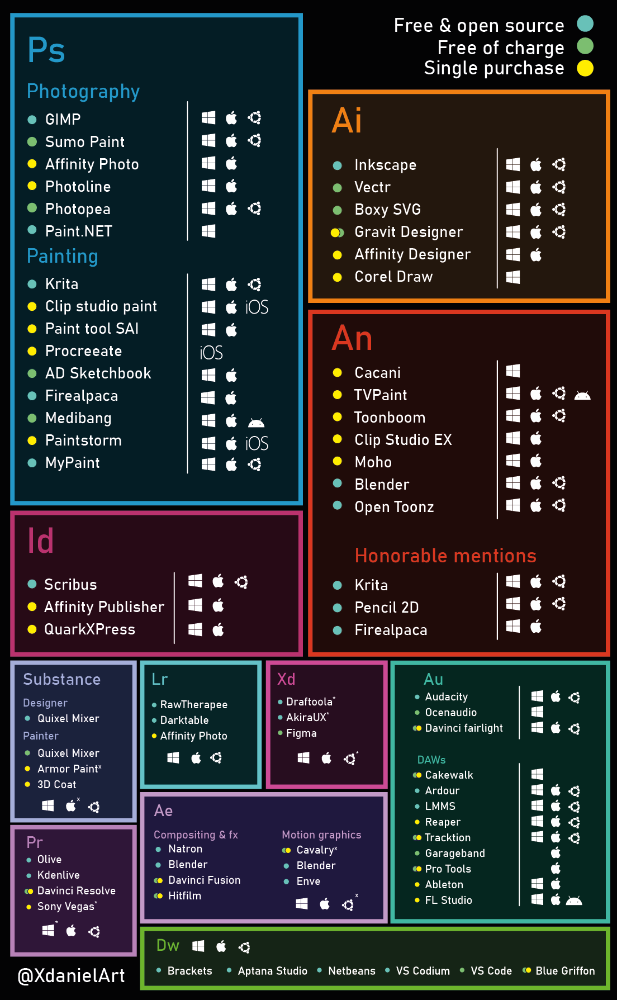

#### [Retour](../README.md#en-ligne-)

# Liens

* [Extensions](#extensions)
* [Logiciels](#logiciels)
* [Astuces](#astuces-variées)
* [Outils](#outils)
* [Minecraft](#minecraft)

## Extensions

* ### Bloqueurs de publicités

  * [L'incontournable Ublock Origin](https://addons.mozilla.org/fr/firefox/addon/ublock-origin/reviews/?utm_source=firefox-browser&utm_medium=firefox-browser&utm_content=addons-manager-reviews-link)
  * [AdNauseam](https://addons.mozilla.org/fr/firefox/addon/adnauseam/)  
  * [Unpaywall](https://chrome.google.com/webstore/detail/unpaywall/iplffkdpngmdjhlpjmppncnlhomiipha)

* ### Youtube c'était mieux avant

  * [Return Youtube Dislike](https://addons.mozilla.org/fr/firefox/addon/return-youtube-dislikes/reviews/?utm_source=firefox-browser&utm_medium=firefox-browser&utm_content=addons-manager-reviews-link)  
  * [SponsorBlock](https://addons.mozilla.org/fr/firefox/addon/sponsorblock/?utm_source=addons.mozilla.org&utm_medium=referral&utm_content=search)

## Logiciels

* ### Gestions de fichier / BD / bibliothèques

  * [Space sniffer](http://www.uderzo.it/main_products/space_sniffer/index.html)
  * [Calibre](https://calibre-ebook.com/fr)

* ### Alternatives Adobe

    

## Astuces variées

* ### Numérique

  * [Bloquer la publicité, partout](https://framablog.org/2022/06/11/de-la-pub-ou-ca/)

* ### Style de vie

  * [Réparer, faire durer ses objets](https://longuevieauxobjets.gouv.fr/)
  * [Vêtements qui durent dans le temps](https://www.reddit.com/r/france/comments/vl2fh2/de_bonnes_marques_de_v%C3%AAtements_hommes_qui_durent/)

## Outils & ressources en ligne

* ### Montage photo

  * [Montage photo - Pixlr](https://pixlr.com/fr/x/)
  * [PWA for Color Matching](https://match.color.io/)
  * [Enlever des éléments de photos](https://cleanup.pictures/)
  * [Convertisseur de format](https://convertio.co/fr/)

* ### Images

  * [Icones open source](https://tablericons.com/)
  * [PNGs pour usage non commercial](https://www.pikpng.com/)

* ### Bureautique

  * [Google drive](https://drive.google.com/drive/u/0/my-drive)
  * [Cartes mentales / diagrammes](https://app.diagrams.net/)
  * [Modifications de PDFs](https://smallpdf.com/fr/modifier-un-pdf)

* ### Blender

  * [Polygon](https://www.poliigon.com/textures/free)
  * [Ambientcg](https://ambientcg.com/)
  * [Polyhaven](https://polyhaven.com/)
  * [Stable Diffusion - texture](https://www.reddit.com/r/blender/comments/zmomxw/stable_diffusion_can_texture_your_entire_scene/)
  * [BlockBlender](https://www.youtube.com/watch?v=TUw65gz8nOs)

* ### Ressources

  * [Raccourcis claviers dans Windows](https://support.microsoft.com/fr-fr/windows/raccourcis-clavier-dans-windows-dcc61a57-8ff0-cffe-9796-cb9706c75eec)  
  

## Minecraft

* ### Documentation

  * [Documentation WorldEdit](https://worldedit.enginehub.org/en/latest/)
  * [Documentation Optifine](https://optifine.readthedocs.io/)
  * [Patterns WorldEdit](https://docs.google.com/document/d/176SgJ7ZeAAGX-A6FnnY2yaIE6_nAKXNlLpuxOPLRH-A/edit?usp=drive_web&ouid=111429833868159511368)

* ### Outils

  * [Générateur de fichier cit](https://pablomcprojects.github.io/documents/tools/cit.html)
  * [Bot discord d'assistance](https://www.wynem.com/?commands=minecraft/resourcepacks)
  * [Minecraft Tools](https://minecraft.tools/fr/)

* ### Assistants construction

  * [Gradients](https://1280px.github.io/hueblocks/)
  * [lignes courbes](https://iseenbaas.nl/curve/)
  * [formes géométriques](https://minecraftshapes.com/)
  * [formes convexes](http://oranj.io/blog/VoxelSphereGenerator)
